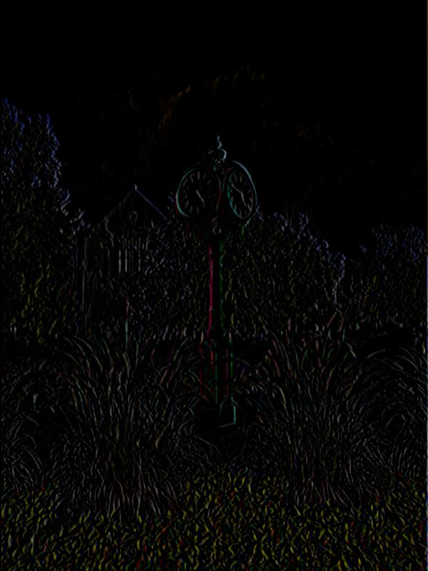

# Image Convolution from scratch

## Applying 3x3 and 5x5 kernels to an image

We deal with boundaries as follows:

+ Padding an image with 1 row of white pixels for a 3x3 image.
+ Padding an image with 2 rows of white pixels for a 5x5 image.

For a deep dive, please look at the [notebook here](playground.ipynb) and the [source code here](lab1.py).

## Sample outputs

| Original Image                     | Kernel                                | Filtered Image             |
| ---------------------------------- | ------------------------------------- | -------------------------- |
|   | -> Identity kernel ->                 |   |
|   | -> Box blur kernel ->                 |   |
|   | -> Horizontal derivative kernel ->    |   |
|   | -> Approximated Gaussian kernel ->    |   |
|   | -> Sharpening kernel (alpha = 0.9) -> |   |
|   | -> Derivative of Gaussian kernel ->   |   |
